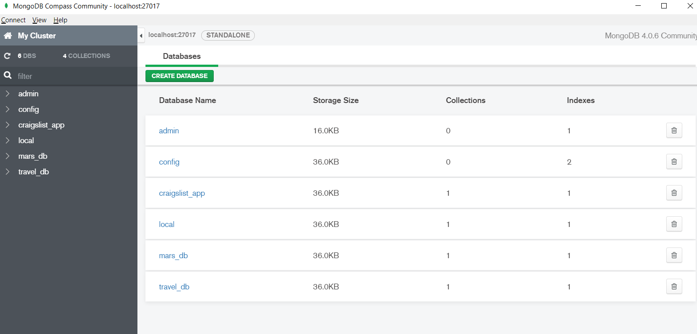
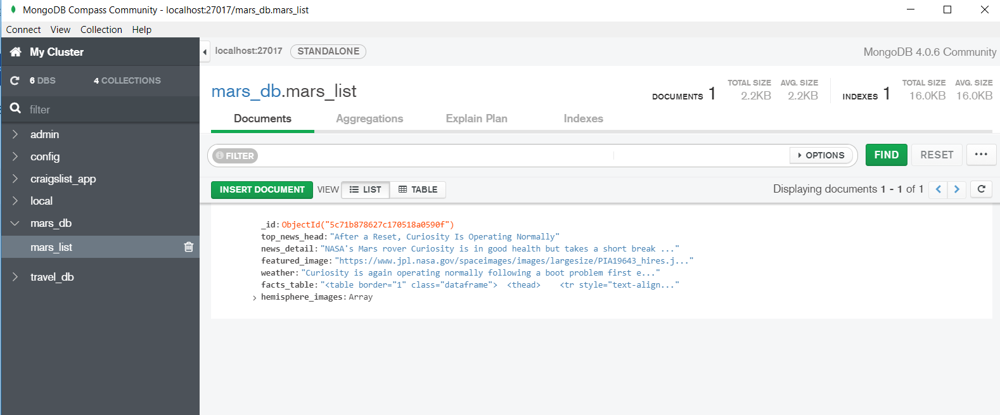
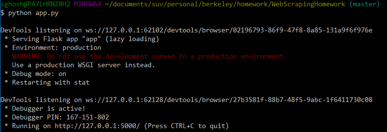
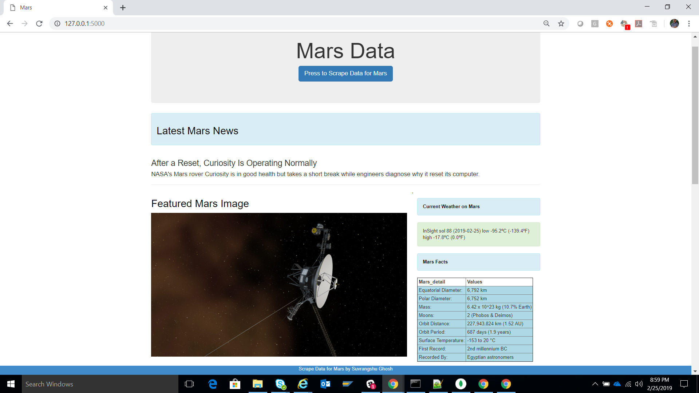


# -:Scrape data for Mars:-

By Suvrangshu Ghosh

The homework consists of the following sections:
1. Scraping multiple websites and gathering data.
2. Creating database in Mongodb.
3. Creating Listings under mongo database.
4. Use MongoDb with Flask templating to create HTML page that displays all of the information that was scrapped from the various websites.

##### Scraping using Jupyter notebook - **mission_to_mars.ipynb**
##### python script for scraping - **scrapes_mars.py**

##### Mongodb database:

Screen capture showing Mongodb created the following:
Database = **mars_db**

 

Under database mars_db collection mars_list is created 

Collections = mars_list has the following entry in dictionary format:
{"_id":"5c71b878627c170518a0590f",
"**top_news_head**":"After a Reset, Curiosity Is Operating Normally",
"**news_detail**":"NASA's Mars rover Curiosity is in good health but takes a short break while engineers diagnose why it reset its computer. ",
"**featured_image**":"https://www.jpl.nasa.gov/spaceimages/images/largesize/PIA19643_hires.jpg",
"**weather**":"Curiosity is again operating normally following a boot problem first experienced last Friday. Look for more Gale Crater weather conditions soon.",
"**facts_table**":"<table border=\"1\" class=\"dataframe\">  <thead>    <tr style=\"text-align: right;\">      <th></th>      <th>Mars_detail</th>      <th>Values</th>    </tr>  </thead>  <tbody>    <tr>      <th>0</th>      <td>Equatorial Diameter:</td>      <td>6,792 km</td>    </tr>    <tr>      <th>1</th>      <td>Polar Diameter:</td>      <td>6,752 km</td>    </tr>    <tr>      <th>2</th>      <td>Mass:</td>      <td>6.42 x 10^23 kg (10.7% Earth)</td>    </tr>    <tr>      <th>3</th>      <td>Moons:</td>      <td>2 (Phobos &amp; Deimos)</td>    </tr>    <tr>      <th>4</th>      <td>Orbit Distance:</td>      <td>227,943,824 km (1.52 AU)</td>    </tr>    <tr>      <th>5</th>      <td>Orbit Period:</td>      <td>687 days (1.9 years)</td>    </tr>    <tr>      <th>6</th>      <td>Surface Temperature:</td>      <td>-153 to 20 °C</td>    </tr>    <tr>      <th>7</th>      <td>First Record:</td>      <td>2nd millennium BC</td>    </tr>    <tr>      <th>8</th>      <td>Recorded By:</td>      <td>Egyptian astronomers</td>    </tr>  </tbody></table>",
"**hemisphere_images**":[{"title":"Cerberus Hemisphere Enhanced","img_url":"http://astropedia.astrogeology.usgs.gov/download/Mars/Viking/cerberus_enhanced.tif/full.jpg"},{"title":"Schiaparelli Hemisphere Enhanced","img_url":"http://astropedia.astrogeology.usgs.gov/download/Mars/Viking/schiaparelli_enhanced.tif/full.jpg"},{"title":"Syrtis Major Hemisphere Enhanced","img_url":"http://astropedia.astrogeology.usgs.gov/download/Mars/Viking/syrtis_major_enhanced.tif/full.jpg"},{"title":"Valles Marineris Hemisphere Enhanced","img_url":"http://astropedia.astrogeology.usgs.gov/download/Mars/Viking/valles_marineris_enhanced.tif/full.jpg"}]}

##### Website screen shots:
**______________________________________________________________________________**
**Note:** *Please be informed that at times the webites from where I’m scraping data can be extra slow resulting in errors, to avoid that I have put time.sleep() at various places to slow down the scraping process and avoid issues.Sometimes the web can be down too.*
**_____________________________________________________________________________**

##### To start the process:
-	Go to the directory where the app.py is located
-	Open gitbash and cd to the directory.
-	Execute python app.py
-	You should see devtools starting:

-	Open Web (Google Chrome browser) and type: ## http://127.0.0.1:5000/
**_______________________________________________________________________________**
*<u>**Note on Mars weather Twit:**</u>
Please be informed that the website(https://twitter.com/marswxreport?lang=en) is temporarily not giving latest weather details, soon they will start again. Once the details are available, the scraping code will automatically scrape the correct data.*
**_______________________________________________________________________________**

To start scraping, please press the button called “Press to Scrape for Mars”
This is a single page, kindly **scroll** down to see more details:

